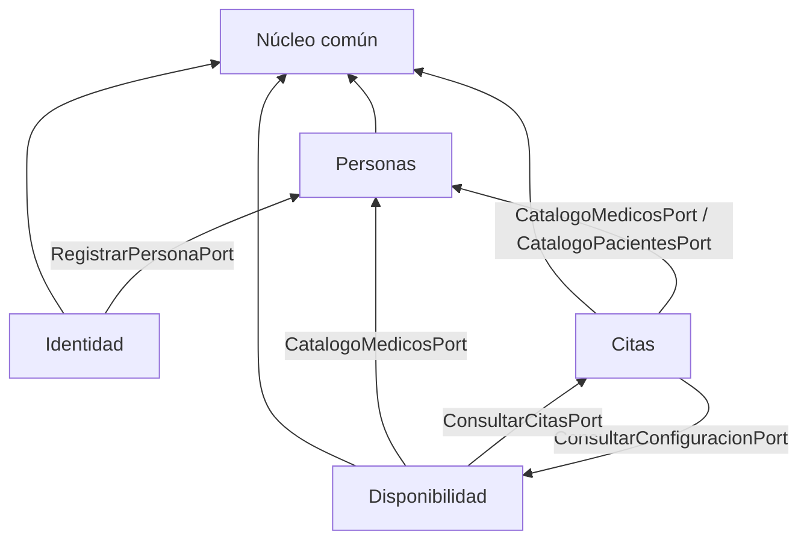

# Arquitectura

Monolito modular con **Dependency Inversion** entre módulos: la comunicación
pasa por puertos (interfaces) declarados por el consumidor e implementados
por fachadas del módulo proveedor.

```
com.piedraazul
├── nucleo            # Value objects, enums, excepciones compartidas
├── identidad         # RF2 — usuarios, roles, JWT, SecurityConfig
├── personas          # RF1/RF2 — pacientes, médicos, especialidades
├── disponibilidad    # RF3 — ventanas, periodos, franjas
└── citas             # RF1/RF2 — agenda y ciclo de vida de citas
```

Cada módulo de negocio lleva su propia capa `infraestructura` (REST, JPA, DTO).
La seguridad transversal vive en **Identidad**, no en un paquete aparte.

## Dependencias entre módulos



## Diagramas de clases

Solo los PlantUML de **implementación** (los mismos `.puml` del skeleton):

- [Núcleo](diagramas/01-nucleo.md)
- [Identidad](diagramas/02-identidad.md)
- [Personas](diagramas/03-personas.md)
- [Disponibilidad](diagramas/04-disponibilidad.md)
- [Citas](diagramas/05-citas.md)

Índice: [Diagramas](diagramas/index.md).
