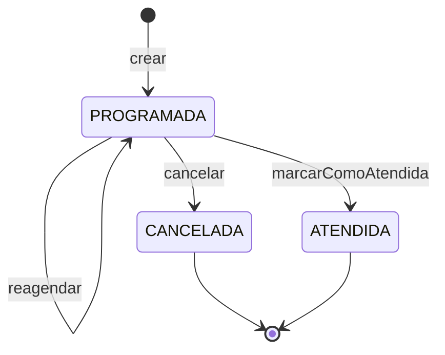

# Módulo Citas

Agendar, cancelar, reagendar y atender citas, más el historial de consultas.
Corresponde a `diagramas-por-modulo/05_modulo_citas.puml`.

## Requisitos funcionales

| RF | Rol | Qué resuelve este módulo |
|---|---|---|
| **RF1** | Agendador | Listar las citas de un médico en una fecha, con la cantidad y con orden configurable |
| **RF2** | Paciente | Registrarse en la web y agendar sobre franjas reales, de forma segura y usable |
| RF3 | Administrador | Respeta la ventana y el horario que configuró Disponibilidad |

## Ciclo de vida de la cita



`CANCELADA` y `ATENDIDA` son estados finales: cualquier intento de modificarlos
lanza `CITA_NO_MODIFICABLE`. La cita **no se borra** al atenderse; queda con
estado `ATENDIDA` para trazabilidad y además se crea una `Consulta`, que es lo
que se muestra en el historial.

Sólo las citas `PROGRAMADA` ocupan agenda: al cancelar una, su franja vuelve a
ofrecerse automáticamente.

## Arquitectura hexagonal

```
com.piedraazul.citas
├── dominio/
│   ├── Cita                      # ciclo de vida completo
│   ├── Consulta                  # se crea sólo desde una cita ATENDIDA
│   └── OrdenCitas                # criterios de ordenamiento del RF1
├── aplicacion/
│   ├── puertos/entrada/          # GestionarCita…, ListarCitasPorMedico…, ConsultarHistorial…
│   ├── puertos/salida/           # CitaRepository, ConsultaRepository
│   │                             # ConsultarCitasPort (público)
│   └── servicio/                 # Services + CitasModuleFacade + CitaDtoAssembler
└── infraestructura/
    ├── dto/
    ├── persistencia/             # JPA + Adapters
    └── rest/                     # CitaController
```

### Dependencias entre módulos

| Necesita | De quién | Para qué |
|---|---|---|
| `CatalogoMedicosPort` | Personas | Médico activo; nombre para el listado |
| `CatalogoPacientesPort` | Personas | Paciente registrado (RF2); nombre y teléfono para la tabla |
| `ConsultarConfiguracionPort` | Disponibilidad | Ventana de agendamiento y horario vigente |
| `PeriodoDisponibilidadRef` | Disponibilidad | Preguntar si la hora pedida cabe en el horario |

Y publica hacia Disponibilidad:

| Puerto público | Implementado por | Consumidor |
|---|---|---|
| `ConsultarCitasPort` | `CitasModuleFacade` | Disponibilidad (rangos ocupados) |

!!! note "No hay ciclo de beans"
    Citas y Disponibilidad se consumen mutuamente, pero a través de fachadas que
    sólo dependen de su propio repositorio: `CitasModuleFacade → CitaRepository` y
    `DisponibilidadModuleFacade → DisponibilidadRepository`. Spring resuelve el
    grafo sin referencias circulares.

## Validaciones al agendar y reagendar

`agendar()` y `reagendar()` comparten las mismas comprobaciones, en este orden:

1. **Paciente registrado** — RF2 exige registro previo → `PACIENTE_NO_ENCONTRADO` (404).
2. **Médico activo** → `MEDICO_NO_DISPONIBLE` (409).
3. **Rango horario válido** — lo garantiza el constructor de `TimeRange` (mínimo 30 min).
4. **Dentro de la ventana** de agendamiento → `FUERA_DE_VENTANA_AGENDAMIENTO` (409).
5. **No es una franja que ya pasó** hoy → `SLOT_NO_DISPONIBLE` (409).
6. **Dentro del horario vigente**: el médico atiende ese día, la hora cae en la
   franja y coincide con un slot exacto de la rejilla → `MEDICO_NO_DISPONIBLE` o
   `SLOT_NO_DISPONIBLE`.
7. **Sin solapamiento** con otra cita `PROGRAMADA` del mismo médico →
   `SLOT_NO_DISPONIBLE` (409).

Al reagendar se comprueba primero que la cita esté `PROGRAMADA`, para que el error
hable del estado de la cita y no de la franja. La comprobación de solapamiento
excluye la propia cita, de modo que mover una cita dentro de su mismo bloque no
choque consigo misma.

## Ordenamiento del listado (RF1)

`OrdenCitas` acepta `HORA_ASC`, `HORA_DESC`, `ESTADO_ASC`, `ESTADO_DESC`,
`PACIENTE_ASC` y `PACIENTE_DESC`. Un valor vacío cae en `HORA_ASC`; un valor
desconocido responde `ORDEN_INVALIDO`.

El reparto del trabajo es deliberado:

- **Hora y estado** se ordenan en la base de datos, con un `Sort` que aprovecha el
  índice `(medico_id, fecha)` y añade un desempate por hora para que el resultado
  sea estable entre peticiones.
- **Nombre del paciente** se ordena en memoria (con `Collator` en es-CO, así que
  los acentos no alteran el orden alfabético), porque el nombre vive en el módulo
  Personas y Citas sólo conoce el `pacienteId`.

## Roles

Los casos de uso no conocen roles; se validan en la capa de seguridad:

| Operación | Quién |
|---|---|
| `agendar` | Paciente (para sí mismo) o Agendador (para cualquiera) |
| `cancelar` / `reagendar` | El paciente dueño, el Agendador o el Admin |
| `marcarAtendida` | Sólo el Médico |
| listar por médico y fecha | Agendador, Admin, Médico |

Ver [Seguridad](seguridad.md) para el estado actual de esa restricción.

## API REST

Prefijo `/api/citas`.

| Método | Ruta | Descripción |
|---|---|---|
| POST | `/` | Agendar (RF2) → 201 |
| PUT | `/{citaId}/cancelacion` | Cancelar |
| PUT | `/{citaId}/reagendamiento` | Reagendar |
| PUT | `/{citaId}/atencion` | Marcar atendida → devuelve la `Consulta` creada |
| GET | `/{citaId}` | Consultar una cita |
| GET | `/?medicoId=&fecha=&orden=` | **RF1**: listado con cantidad y desglose por estado |
| GET | `/rango?medicoId=&desde=&hasta=` | Citas de un rango, para el calendario |
| GET | `/paciente/{pacienteId}` | "Mis citas" del paciente |
| GET | `/historial/paciente/{pacienteId}` | Historial de consultas del paciente |
| GET | `/historial/medico/{medicoId}` | Historial de consultas del médico |

### Ejemplo: agendar

```bash
curl -X POST http://localhost:8080/api/citas \
  -H 'Content-Type: application/json' \
  -d '{
    "pacienteId": 1,
    "medicoId": 1,
    "fecha": "2026-09-29",
    "horaInicio": "08:00",
    "horaFin": "08:30"
  }'
```

### Ejemplo: listado del RF1

```bash
curl "http://localhost:8080/api/citas?medicoId=1&fecha=2026-09-29&orden=PACIENTE_ASC"
```

```json
{
  "medicoId": 1,
  "medicoNombre": "Dra. Ana Pérez",
  "fecha": "2026-09-29",
  "orden": "PACIENTE_ASC",
  "cantidad": 2,
  "cantidadProgramadas": 2,
  "cantidadCanceladas": 0,
  "cantidadAtendidas": 0,
  "citas": [
    {
      "id": 1,
      "medicoId": 1,
      "medicoNombre": "Dra. Ana Pérez",
      "pacienteId": 1,
      "pacienteNombre": "Juan Ramírez",
      "pacienteTelefono": "3001234567",
      "fecha": "2026-09-29",
      "horaInicio": "08:00",
      "horaFin": "08:30",
      "duracionMinutos": 30,
      "estado": "PROGRAMADA"
    }
  ]
}
```

## Base de datos

| Tabla | Columnas | Notas |
|---|---|---|
| `citas` | `id`, `paciente_id`, `medico_id`, `fecha`, `hora_inicio`, `hora_fin`, `estado` | `estado` como texto (`@Enumerated(STRING)`), legible en SQL |
| `consultas` | `id`, `cita_id`, `medico_id`, `paciente_id`, `fecha`, `observaciones`, `fecha_registro` | `cita_id` único: una cita no genera dos consultas |

Índices, elegidos según los accesos reales:

| Índice | Consulta que sirve |
|---|---|
| `idx_cita_medico_fecha (medico_id, fecha)` | RF1 y vista de calendario |
| `idx_cita_medico_fecha_estado (medico_id, fecha, estado)` | Rangos ocupados y detección de solapamiento |
| `idx_cita_paciente (paciente_id)` | "Mis citas" |
| `idx_consulta_paciente (paciente_id, fecha)` | Historial del paciente |
| `idx_consulta_medico (medico_id, fecha)` | Historial del médico |

## Extensiones sobre el diagrama

| Añadido | Motivo |
|---|---|
| `OrdenCitas` + variante ordenada de `buscarPorMedicoYFecha` | El RF1 pide poder cambiar el orden del listado |
| `existeSolapamiento(..., citaIdExcluida)` | Al reagendar, la cita no debe chocar consigo misma |
| `buscarPorMedicoEntreFechas` | Vista semanal/mensual del calendario |
| `buscarPorPaciente` + `listarPorPaciente` | El paciente necesita ver sus citas para poder cancelarlas (RF2) |
| `buscarProgramadasPorMedicoYFecha` | Que sólo las citas programadas ocupen agenda |
| `ConsultaRepository.buscarPorCitaId` | Idempotencia al marcar atendida |
| Nombres y teléfono en `CitaResponseDTO`, desglose por estado en `ListadoCitasResponseDTO` | Que la tabla del RF1 sea legible sin una consulta por fila |
| `CatalogoPacientesPort` (en Personas) | Resolver el nombre del paciente sin importar su entidad |
