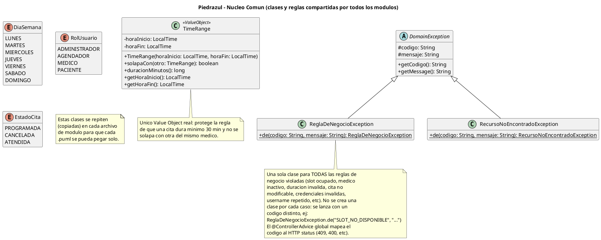

# Núcleo común

Enums, value objects y excepciones compartidas (`com.piedraazul.nucleo`).

Diagrama PlantUML de **implementación** (fuente usada para el código).

Archivo: [`puml/01_nucleo_comun.puml`](puml/01_nucleo_comun.puml)

