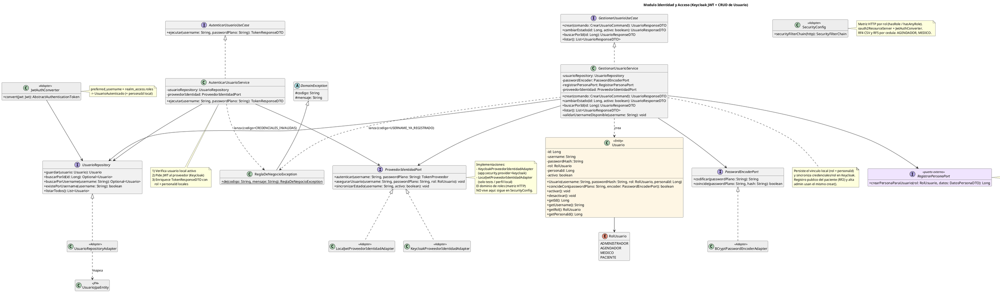

# Identidad

Módulo `com.piedraazul.identidad`.

Fuente: [`puml/02_modulo_identidad.puml`](puml/02_modulo_identidad.puml)

```plantuml
@startuml 02_modulo_identidad
title Modulo Identidad y Acceso (Keycloak JWT + CRUD de Usuario)

skinparam classAttributeIconSize 0
skinparam class {
  BackgroundColor<<Entity>> #FEF6E4
  BackgroundColor<<interface>> #E4F0FE
  BorderColor<<interface>> #2E5C8A
  BackgroundColor<<RestController>> #EDEDED
  BackgroundColor<<Adapter>> #EDEDED
  BackgroundColor<<JPA>> #EDEDED
  BackgroundColor<<puerto externo>> #F0E4FE
}
hide empty members

' -- copiado de 01_nucleo_comun.puml --
enum RolUsuario {
  ADMINISTRADOR
  AGENDADOR
  MEDICO
  PACIENTE
}
abstract class DomainException {
  #codigo: String
  #mensaje: String
}
class ReglaDeNegocioException extends DomainException {
  +{static} de(codigo: String, mensaje: String): ReglaDeNegocioException
}

' =====================================================================
' DOMINIO
' =====================================================================
class Usuario <<Entity>> {
  -id: Long
  -username: String
  -passwordHash: String
  -rol: RolUsuario
  -personaId: Long
  -activo: boolean
  +Usuario(username: String, passwordHash: String, rol: RolUsuario, personaId: Long)
  +coincideCon(passwordPlano: String, encoder: PasswordEncoderPort): boolean
  +activar(): void
  +desactivar(): void
  +getId(): Long
  +getUsername(): String
  +getRol(): RolUsuario
  +getPersonaId(): Long
}
Usuario --> RolUsuario

' =====================================================================
' PUERTOS DE SALIDA
' =====================================================================
interface UsuarioRepository {
  +guardar(usuario: Usuario): Usuario
  +buscarPorId(id: Long): Optional<Usuario>
  +buscarPorUsername(username: String): Optional<Usuario>
  +existePorUsername(username: String): boolean
  +listarTodos(): List<Usuario>
}
interface PasswordEncoderPort {
  +codificar(passwordPlano: String): String
  +coincide(passwordPlano: String, hash: String): boolean
}
' RNF1: emision/validacion de JWT delegada a Keycloak (Docker).
' En tests/dev sin contenedor existe un emisor local Nimbus compatible.
interface ProveedorIdentidadPort {
  +autenticar(username: String, passwordPlano: String): TokenProveedor
  +asegurarUsuario(username: String, passwordPlano: String, rol: RolUsuario): void
  +sincronizarEstado(username: String, activo: boolean): void
}
note right of ProveedorIdentidadPort
  Implementaciones:
  - KeycloakProveedorIdentidadAdapter
    (app.security.provider=keycloak)
  - LocalJwtProveedorIdentidadAdapter
    (solo tests / perfil local)
  El dominio de roles (matriz HTTP)
  NO vive aqui: sigue en SecurityConfig.
end note

' -- puerto EXTERNO: implementado por el Modulo Personas.
interface RegistrarPersonaPort <<puerto externo>> {
  +crearPersonaParaUsuario(rol: RolUsuario, datos: DatosPersonaDTO): Long
}
note right of RegistrarPersonaPort
  Implementado en 03_modulo_personas.puml
  (crea un Medico si rol=MEDICO, un Paciente
  si rol=PACIENTE; si rol=ADMINISTRADOR o
  AGENDADOR no crea nada y retorna null).
end note

' =====================================================================
' PUERTOS DE ENTRADA
' =====================================================================
interface GestionarUsuarioUseCase {
  +crear(comando: CrearUsuarioCommand): UsuarioResponseDTO
  +cambiarEstado(id: Long, activo: boolean): UsuarioResponseDTO
  +buscarPorId(id: Long): UsuarioResponseDTO
  +listar(): List<UsuarioResponseDTO>
}
interface AutenticarUsuarioUseCase {
  +ejecutar(username: String, passwordPlano: String): TokenResponseDTO
}

' =====================================================================
' SERVICIOS DE APLICACION
' =====================================================================
class GestionarUsuarioService implements GestionarUsuarioUseCase {
  -usuarioRepository: UsuarioRepository
  -passwordEncoder: PasswordEncoderPort
  -registrarPersonaPort: RegistrarPersonaPort
  -proveedorIdentidad: ProveedorIdentidadPort
  +crear(comando: CrearUsuarioCommand): UsuarioResponseDTO
  +cambiarEstado(id: Long, activo: boolean): UsuarioResponseDTO
  +buscarPorId(id: Long): UsuarioResponseDTO
  +listar(): List<UsuarioResponseDTO>
  -validarUsernameDisponible(username: String): void
}
GestionarUsuarioService --> UsuarioRepository
GestionarUsuarioService --> PasswordEncoderPort
GestionarUsuarioService --> RegistrarPersonaPort
GestionarUsuarioService --> ProveedorIdentidadPort
GestionarUsuarioService ..> Usuario : crea
GestionarUsuarioService ..> ReglaDeNegocioException : lanza (codigo=USERNAME_YA_REGISTRADO)
note bottom of GestionarUsuarioService
  Persiste el vinculo local (rol + personaId)
  y sincroniza credenciales/rol en Keycloak.
  Registro publico del paciente (RF2) y alta
  admin usan el mismo crear().
end note

class AutenticarUsuarioService implements AutenticarUsuarioUseCase {
  -usuarioRepository: UsuarioRepository
  -proveedorIdentidad: ProveedorIdentidadPort
  +ejecutar(username: String, passwordPlano: String): TokenResponseDTO
}
AutenticarUsuarioService --> UsuarioRepository
AutenticarUsuarioService --> ProveedorIdentidadPort
AutenticarUsuarioService ..> ReglaDeNegocioException : lanza (codigo=CREDENCIALES_INVALIDAS)
note bottom of AutenticarUsuarioService
  1) Verifica usuario local activo
  2) Pide JWT al proveedor (Keycloak)
  3) Enriquece TokenResponseDTO con
     rol + personaId locales
end note

' =====================================================================
' INFRAESTRUCTURA
' =====================================================================
class AuthController <<RestController>> {
  -autenticarUsuarioUseCase: AutenticarUsuarioUseCase
  -gestionarUsuarioUseCase: GestionarUsuarioUseCase
  +login(request: LoginRequestDTO): ResponseEntity
  +registrarPaciente(request: RegistrarPacienteRequestDTO): ResponseEntity
}
class UsuarioController <<RestController>> {
  -gestionarUsuarioUseCase: GestionarUsuarioUseCase
  +crear(request): ResponseEntity
  +cambiarEstado(id: Long, activo: boolean): ResponseEntity
  +listar(): ResponseEntity
}
class SecurityConfig <<Adapter>> {
  +securityFilterChain(http): SecurityFilterChain
}
note right of SecurityConfig
  Matriz HTTP por rol (hasRole / hasAnyRole).
  oauth2ResourceServer + JwtAuthConverter.
  RF4 CSV y RF5 por cedula: AGENDADOR, MEDICO.
end note
class JwtAuthConverter <<Adapter>> {
  +convert(jwt: Jwt): AbstractAuthenticationToken
}
note right of JwtAuthConverter
  preferred_username + realm_access.roles
  -> UsuarioAutenticado (+ personaId local)
end note
class KeycloakProveedorIdentidadAdapter <<Adapter>> implements ProveedorIdentidadPort
class LocalJwtProveedorIdentidadAdapter <<Adapter>> implements ProveedorIdentidadPort
class BCryptPasswordEncoderAdapter <<Adapter>> implements PasswordEncoderPort
class UsuarioRepositoryAdapter <<Adapter>> implements UsuarioRepository
class UsuarioJpaEntity <<JPA>>
class UsuarioAutenticado
class SesionActual
UsuarioRepositoryAdapter ..> UsuarioJpaEntity : mapea
JwtAuthConverter --> UsuarioRepository
SesionActual ..> UsuarioAutenticado : lee del SecurityContext

' =====================================================================
' DTOs
' =====================================================================
class CrearUsuarioCommand <<DTO>> {
  +username: String
  +password: String
  +rol: RolUsuario
  +datosPersona: DatosPersonaDTO
}
class DatosPersonaDTO <<DTO>> {
  +nombreCompleto: String
  +telefono: String
  +especialidadId: Long
  +cedula: String
}
class RegistrarPacienteRequestDTO <<DTO>>
class LoginRequestDTO <<DTO>> {
  +username: String
  +password: String
}
class TokenResponseDTO <<DTO>> {
  +accessToken: String
  +tokenType: String
  +expiresIn: long
  +rol: RolUsuario
  +personaId: Long
  +usuarioId: Long
}
class UsuarioResponseDTO <<DTO>> {
  +id: Long
  +username: String
  +rol: RolUsuario
  +personaId: Long
  +activo: boolean
}

@enduml
```
