# Disponibilidad

Ventana, periodos y slots (`com.piedraazul.disponibilidad`).

Diagrama PlantUML de **implementación** (fuente usada para el código).

Archivo: [`puml/04_modulo_disponibilidad.puml`](puml/04_modulo_disponibilidad.puml)

```plantuml
@startuml 04_modulo_disponibilidad
title Modulo Disponibilidad (RF3 - la parte dificil: horarios que cambian en el tiempo)

skinparam classAttributeIconSize 0
skinparam class {
  BackgroundColor<<Entity>> #FEF6E4
  BackgroundColor<<ValueObject>> #FEF6E4
  BackgroundColor<<interface>> #E4F0FE
  BorderColor<<interface>> #2E5C8A
  BackgroundColor<<RestController>> #EDEDED
  BackgroundColor<<Adapter>> #EDEDED
  BackgroundColor<<JPA>> #EDEDED
  BackgroundColor<<puerto externo>> #F0E4FE
}
hide empty members

' -- copiados de 01_nucleo_comun.puml --
enum DiaSemana {
  LUNES
  MARTES
  MIERCOLES
  JUEVES
  VIERNES
  SABADO
  DOMINGO
}
class TimeRange <<ValueObject>> {
  -horaInicio: LocalTime
  -horaFin: LocalTime
  +solapaCon(otro: TimeRange): boolean
  +duracionMinutos(): long
}
abstract class DomainException {
  #codigo: String
  #mensaje: String
}
class ReglaDeNegocioException extends DomainException {
  +{static} de(codigo: String, mensaje: String): ReglaDeNegocioException
}

' -- puertos EXTERNOS: implementados en otros modulos --
interface CatalogoMedicosPort <<puerto externo>> {
  +existeMedicoActivo(medicoId: Long): boolean
}
interface ConsultarCitasPort <<puerto externo>> {
  +obtenerRangosOcupados(medicoId: Long, fecha: LocalDate): List<TimeRange>
}
note right of CatalogoMedicosPort
  Implementado en 03_modulo_personas.puml
end note
note right of ConsultarCitasPort
  Implementado en 05_modulo_citas.puml
end note

' =====================================================================
' DOMINIO
' =====================================================================
' Parametro GLOBAL del sistema (una sola fila): cuantas semanas a futuro
' se puede agendar. No depende del medico.
class ConfiguracionSistema <<Entity>> {
  -id: Long
  -ventanaSemanas: int
  +actualizarVentana(semanas: int): void
  +getVentanaSemanas(): int
}

' Aca esta lo dificil: un medico puede tener VARIOS periodos de
' disponibilidad a lo largo del tiempo (ej. lunes-viernes las
' primeras 2 semanas, luego martes-jueves las siguientes). Cada
' fila es un "contrato de horario" valido solo en un rango de fechas.
class PeriodoDisponibilidad <<Entity>> {
  -id: Long
  -medicoId: Long
  -fechaInicio: LocalDate
  -fechaFin: LocalDate
  -diasAtencion: Set<DiaSemana>
  -franjaHoraria: TimeRange
  -duracionCitaMinutos: int
  +PeriodoDisponibilidad(medicoId, fechaInicio, fechaFin, diasAtencion, franjaHoraria, duracionCitaMinutos)
  +incluyeFecha(fecha: LocalDate): boolean
  +atiendeEnDia(dia: DiaSemana): boolean
  +cerrarEn(fecha: LocalDate): void
  +getFranjaHoraria(): TimeRange
  +getDuracionCitaMinutos(): int
}
PeriodoDisponibilidad *-- TimeRange
PeriodoDisponibilidad --> DiaSemana
PeriodoDisponibilidad ..> ReglaDeNegocioException : lanza si duracion < 30 (codigo=DURACION_CITA_INVALIDA)

note bottom of PeriodoDisponibilidad
  fechaFin = null significa "vigente hasta que
  se cree un periodo nuevo". Al crear un periodo
  que empieza donde otro sigue vigente, el
  servicio cierra automaticamente el anterior
  (cerrarEn) para que nunca se solapen dos
  periodos del mismo medico.
end note

' =====================================================================
' PUERTO DE SALIDA
' =====================================================================
interface DisponibilidadRepository {
  +obtenerConfiguracionSistema(): ConfiguracionSistema
  +guardarConfiguracionSistema(config: ConfiguracionSistema): ConfiguracionSistema
  +guardarPeriodo(periodo: PeriodoDisponibilidad): PeriodoDisponibilidad
  +buscarPeriodoVigente(medicoId: Long, fecha: LocalDate): Optional<PeriodoDisponibilidad>
  +buscarPeriodoAbiertoAnterior(medicoId: Long): Optional<PeriodoDisponibilidad>
  +listarPeriodosPorMedico(medicoId: Long): List<PeriodoDisponibilidad>
}
DisponibilidadRepository ..> ConfiguracionSistema
DisponibilidadRepository ..> PeriodoDisponibilidad

' =====================================================================
' PUERTO PUBLICO (lo consume Citas para validar que una hora solicitada
' realmente caiga dentro del horario vigente del medico)
' =====================================================================
interface ConsultarConfiguracionPort {
  +obtenerVentanaSemanas(): int
  +obtenerPeriodoVigente(medicoId: Long, fecha: LocalDate): PeriodoDisponibilidad
}
note right of ConsultarConfiguracionPort
  Consumido por: Citas (05_modulo_citas.puml)
end note

' =====================================================================
' ALGORITMO - Strategy (unico punto de extension si mas adelante
' cambian la regla de calculo, sin tocar el caso de uso)
' =====================================================================
class SlotDisponible <<ValueObject>> {
  -fecha: LocalDate
  -rango: TimeRange
}
SlotDisponible *-- TimeRange

interface CalculadorSlotsStrategy <<Strategy>> {
  +calcular(periodo: PeriodoDisponibilidad, fecha: LocalDate, rangosOcupados: List<TimeRange>): List<SlotDisponible>
}
class CalculadorSlotsPorIntervaloFijo implements CalculadorSlotsStrategy {
  +calcular(periodo: PeriodoDisponibilidad, fecha: LocalDate, rangosOcupados: List<TimeRange>): List<SlotDisponible>
}
note bottom of CalculadorSlotsPorIntervaloFijo
  Recorre la franja horaria del periodo en
  pasos de duracionCitaMinutos y descarta los
  pasos que se solapan con rangosOcupados.
end note

' =====================================================================
' CASOS DE USO
' =====================================================================
interface ConfigurarVentanaAgendamientoUseCase {
  +ejecutar(semanas: int): ConfiguracionSistemaResponseDTO
}
interface ConfigurarPeriodoDisponibilidadUseCase {
  +ejecutar(comando: ConfigurarPeriodoCommand): PeriodoDisponibilidadResponseDTO
}
interface ConsultarDisponibilidadUseCase {
  +ejecutar(medicoId: Long, fecha: LocalDate): List<SlotDisponibleDTO>
}

class ConfigurarVentanaAgendamientoService implements ConfigurarVentanaAgendamientoUseCase {
  -disponibilidadRepository: DisponibilidadRepository
}
ConfigurarVentanaAgendamientoService --> DisponibilidadRepository

class ConfigurarPeriodoDisponibilidadService implements ConfigurarPeriodoDisponibilidadUseCase {
  -disponibilidadRepository: DisponibilidadRepository
  -catalogoMedicosPort: CatalogoMedicosPort
  +ejecutar(comando: ConfigurarPeriodoCommand): PeriodoDisponibilidadResponseDTO
  -cerrarPeriodoAnteriorSiExiste(medicoId: Long, fechaInicio: LocalDate): void
}
ConfigurarPeriodoDisponibilidadService --> DisponibilidadRepository
ConfigurarPeriodoDisponibilidadService --> CatalogoMedicosPort
ConfigurarPeriodoDisponibilidadService ..> PeriodoDisponibilidad : crea
ConfigurarPeriodoDisponibilidadService ..> ReglaDeNegocioException : lanza (codigo=MEDICO_NO_DISPONIBLE)
note bottom of ConfigurarPeriodoDisponibilidadService
  Este caso de uso (define dias/horario de
  atencion del medico) lo pueden invocar
  Admin, Agendador o el propio Medico (se
  valida el rol en el Controller/JWT, no
  aqui: el caso de uso no sabe de roles).
end note

class ConsultarDisponibilidadService implements ConsultarDisponibilidadUseCase {
  -disponibilidadRepository: DisponibilidadRepository
  -consultarCitasPort: ConsultarCitasPort
  -calculadorSlots: CalculadorSlotsStrategy
  +ejecutar(medicoId: Long, fecha: LocalDate): List<SlotDisponibleDTO>
}
ConsultarDisponibilidadService --> DisponibilidadRepository
ConsultarDisponibilidadService --> ConsultarCitasPort
ConsultarDisponibilidadService --> CalculadorSlotsStrategy
ConsultarDisponibilidadService ..> ReglaDeNegocioException : lanza (codigo=MEDICO_NO_DISPONIBLE, sin periodo vigente)

class DisponibilidadModuleFacade implements ConsultarConfiguracionPort {
  -disponibilidadRepository: DisponibilidadRepository
}
DisponibilidadModuleFacade --> DisponibilidadRepository

' =====================================================================
' INFRAESTRUCTURA - referencia
' =====================================================================
class DisponibilidadController <<RestController>>
class DisponibilidadRepositoryAdapter <<Adapter>> implements DisponibilidadRepository
class ConfiguracionSistemaJpaEntity <<JPA>>
class PeriodoDisponibilidadJpaEntity <<JPA>>

' =====================================================================
' DTOs (esto lo consume FullCalendar en Angular)
' =====================================================================
class ConfigurarPeriodoCommand <<DTO>> {
  +medicoId: Long
  +fechaInicio: LocalDate
  +diasAtencion: Set<DiaSemana>
  +horaInicio: LocalTime
  +horaFin: LocalTime
  +duracionCitaMinutos: int
}
class ConfiguracionSistemaResponseDTO <<DTO>>
class PeriodoDisponibilidadResponseDTO <<DTO>>
class SlotDisponibleDTO <<DTO>> {
  +fecha: LocalDate
  +horaInicio: LocalTime
  +horaFin: LocalTime
}

@enduml
```

