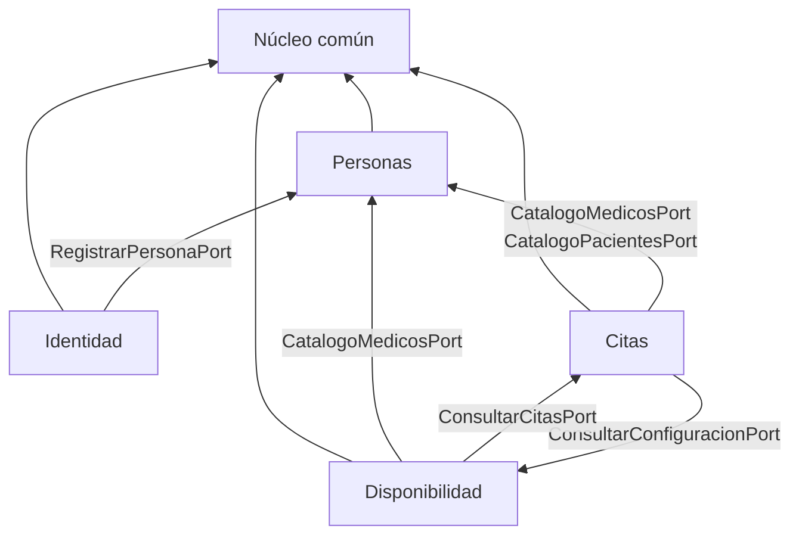

# Módulos

| Módulo | Paquete | Requisitos | Estado |
|---|---|---|---|
| **Núcleo común** | `nucleo` | RF1–RF3 (tipos compartidos) | Implementado |
| **Gestión de Personas** | `personas` | RF1, RF2, RF3 | Implementado |
| **Configuración / Disponibilidad** | `disponibilidad` | RF3, RF2 | Implementado |
| **Gestión de Citas** | `citas` | RF1, RF2 | Implementado |
| **Identidad y Acceso** | `identidad` | RF2 (JWT + roles) | Implementado |

- [Núcleo común](nucleo.md)
- [Personas](personas.md)
- [Disponibilidad](disponibilidad.md)
- [Citas](citas.md)
- [Seguridad](seguridad.md)

## Orden de dependencia

Citas y Disponibilidad se necesitan mutuamente, pero sólo a través de puertos
públicos implementados por fachadas que dependen únicamente de su propio
repositorio, así que no hay ciclo de beans en Spring.

## Regla de aislamiento entre módulos

Un módulo **nunca** importa el repositorio ni la entidad de otro. Sólo su
interfaz de puerto público:

| Puerto público | Lo implementa | Lo consume |
|---|---|---|
| `CatalogoMedicosPort` | `PersonasModuleFacade` | Disponibilidad, Citas |
| `CatalogoPacientesPort` | `PersonasModuleFacade` | Citas |
| `RegistrarPersonaPort` | `PersonasModuleFacade` | Identidad |
| `ConsultarConfiguracionPort` | `DisponibilidadModuleFacade` | Citas |
| `PeriodoDisponibilidadRef` | entidad `PeriodoDisponibilidad` | Citas |
| `ConsultarCitasPort` | `CitasModuleFacade` | Disponibilidad |

## Datos de demostración

**Clase:** `com.piedraazul.bootstrap.SeedDatosDemo` (paquete de arranque de la
app, **no** un módulo de negocio).

Al arrancar Spring Boot, si `app.seed.enabled=true` / `APP_SEED_ENABLED=true` y
aún no existe el usuario `admin`, un `ApplicationRunner` llama a los casos de
uso de Identidad, Personas, Disponibilidad y Citas y siembra:

- Especialidades, usuarios demo (password `demo1234`)
- Pacientes walk-in adicionales
- Horarios de Ana (mañana) y Carlos (tarde)
- Varias citas (programadas, atendidas y canceladas)

`db/init/*.sql` en Docker **no inserta** la demo. Para regenerar:
`docker compose down -v` y volver a levantar.
