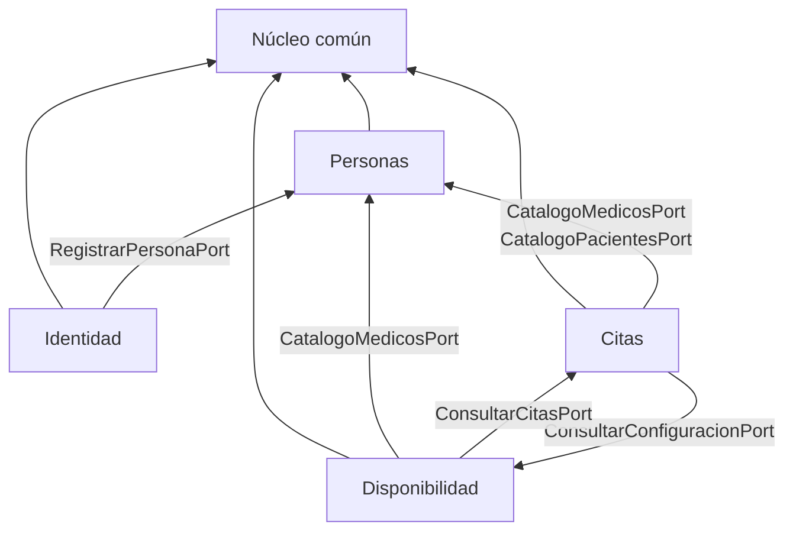

# Módulos

| Módulo | Paquete | Requisitos | Estado |
|---|---|---|---|
| **Núcleo común** | `nucleo` | RF1–RF3 (tipos compartidos) | Implementado |
| **Gestión de Personas** | `personas` | RF1, RF2, RF3 | Implementado |
| **Configuración / Disponibilidad** | `disponibilidad` | RF3, RF2 | Implementado |
| **Gestión de Citas** | `citas` | RF1, RF2 | Implementado |
| Identidad y Acceso | `identidad` | RF2 | Pendiente |
| Notificaciones | `notificaciones` | — | Pendiente |
| Infraestructura transversal | `infraestructura` | Security, JWT, datos de demo | Parcial |

- [Núcleo común](nucleo.md)
- [Personas](personas.md)
- [Disponibilidad](disponibilidad.md)
- [Citas](citas.md)

## Orden de dependencia

Citas y Disponibilidad se necesitan mutuamente, pero sólo a través de puertos
públicos implementados por fachadas que dependen únicamente de su propio
repositorio, así que no hay ciclo de beans en Spring.

## Regla de aislamiento entre módulos

Un módulo **nunca** importa el repositorio ni la entidad de otro. Sólo su
interfaz de puerto público:

| Puerto público | Lo implementa | Lo consume |
|---|---|---|
| `CatalogoMedicosPort` | `PersonasModuleFacade` | Disponibilidad, Citas |
| `CatalogoPacientesPort` | `PersonasModuleFacade` | Citas |
| `RegistrarPersonaPort` | `PersonasModuleFacade` | Identidad (pendiente) |
| `ConsultarConfiguracionPort` | `DisponibilidadModuleFacade` | Citas |
| `PeriodoDisponibilidadRef` | entidad `PeriodoDisponibilidad` | Citas |
| `ConsultarCitasPort` | `CitasModuleFacade` | Disponibilidad |

## Datos de demostración

Al arrancar, `SeedDatosDemo` siembra especialidades, dos médicos con horario, dos
pacientes, la ventana de agendamiento y un par de citas de ejemplo — **sólo si la
base está vacía**. Lo hace invocando los casos de uso, no con SQL, de modo que los
datos sembrados cumplen las mismas reglas de negocio que la aplicación.

Se apaga con `app.seed.enabled=false` (o `APP_SEED_ENABLED=false` como variable de
entorno).
